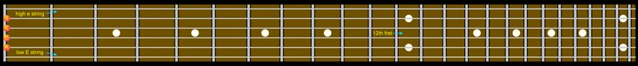

### How to Use These Mnemonics
1. **Select Your Instrument**
First, identify which instrument you are tuning. Whether it's a guitar, violin, bass guitar, cello, or ukulele, we've got a mnemonic for you.
   
2. **Recite the Mnemonic**
Read the mnemonic out loud or in your mind. Focus on the initial letter of each word, which corresponds to a note on your instrument.
   
3. **Tune Your Instrument**
As you tune each string, repeat the mnemonic. This repetition will reinforce the association between the note and the word, making it easier to recall in the future.
   
4. **Practice Regularly**
Like any other skill, the more you practice, the more natural it becomes. Over time, you'll find that you can recall the tuning order effortlessly.

5. **Mix and Match**
We've provided multiple mnemonics for each instrument. Feel free to choose the one that resonates most with you, or even better, create your own personalized version!

---

### **Guitar (E A D G B e)**

- **E**very **A**ngry **D**og **G**rowls, **B**arks, **e**ventually. 
- **E**lephants **A**nd **D**onkeys **G**ot **B**ig **e**ars. | 
- **E**ach **A**pple **D**rops **G**ently **B**elow **e**arth. | 

---

### **Violin (G D A E)**
- **G**rumpy **D**ucks **A**lways **E**at.
- **G**ood **D**inosaurs **A**re **E**xtinct.
- **G**reen **D**ragons **A**dore **E**ggs.

---

### **Bass Guitar (E A D G)**

- **E**very **A**nt **D**ances **G**racefully.
- **E**lephants **A**re **D**efinitely **G**igantic.
- **E**ach **A**fternoon **D**olphins **G**lide.

---

### **Cello (C G D A)**

- **C**ats **G**rowl, **D**ogs **A**rgue.
- **C**hocolate **G**ives **D**elicious **A**ftertaste.
- **C**old **G**ravy **D**rips **A**way.

---

### **Ukulele (G C E A)**

- **G**eckos **C**an't **E**at **A**pples.
- **G**ood **C**ooks **E**at **A**lot.
- **G**reen **C**arrots **E**nd **A**bruptly.

---

